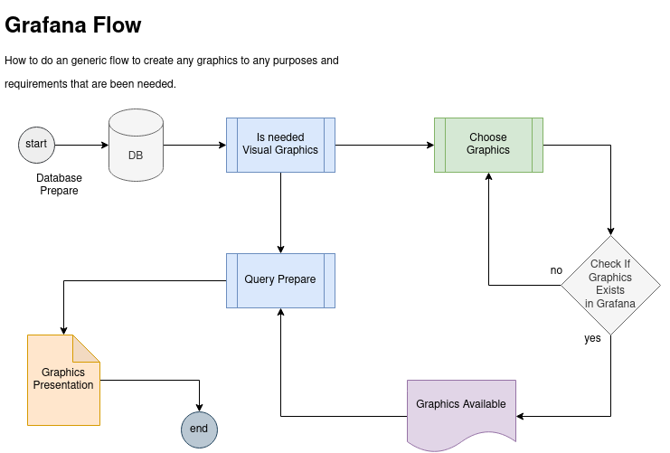
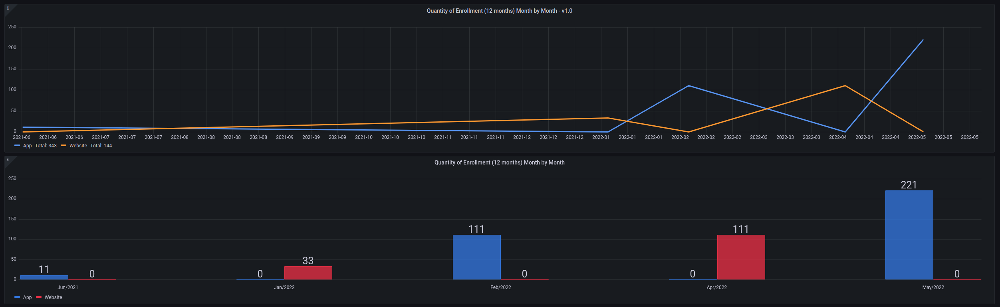
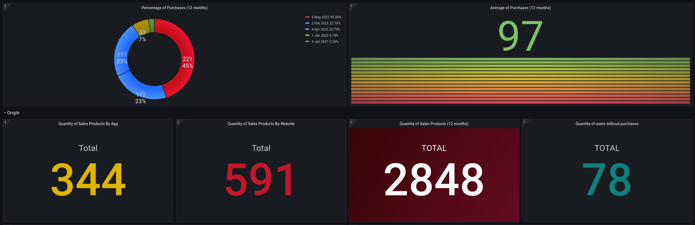
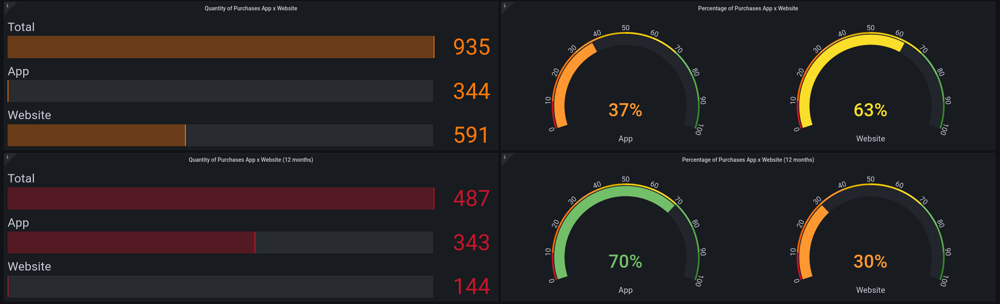
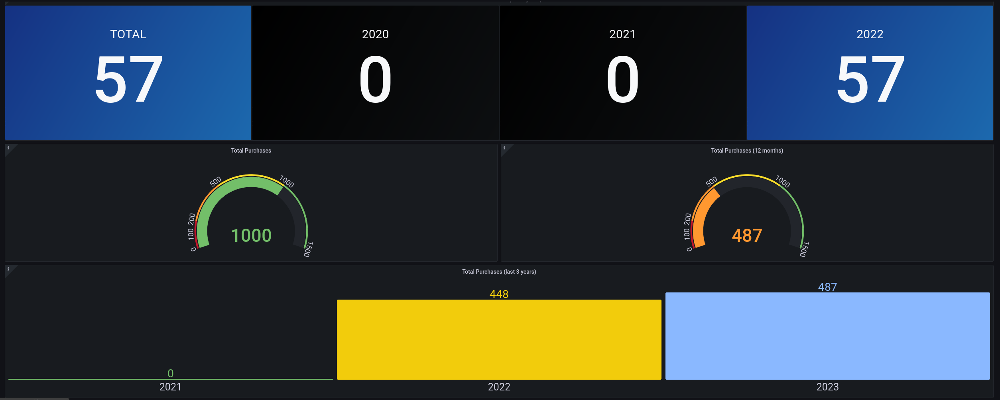
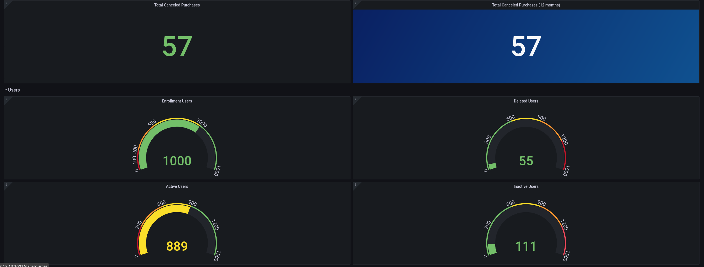

# GRAFANA DASHBOARD SAMPLES

---

# Resources Files

- dashboard/DASH SAMPLE-1654088708257.json
- database/queries.sql
- database/db-init-purchases.sh
- database/db-init-users.sh
- database/db-purchases-insert.sql
- database/db-sample-project.sql
- database/db-users-insert.sql
- database/purchases_202206010923.sql

----

# Overview

> A series of the panels into dashboard created on Grafana

----

# Graphics Sample

----

# How to use

Firstly install grafana in your environment, you can use the docker-series in this account to make this step. 

After grafana installed and set up the access to grafana dashboard, create a database sample in your mysql server, import the 
data from database path of this project, and so add the data source in grafana and use this datasource.

Finally, import the JSON File Grafana Project (DASH SAMPLE-1654088708257.json) in grafana application, make an adjusts and 
you can see the complete graphics sample from this project.

 
Enjoy !

----
